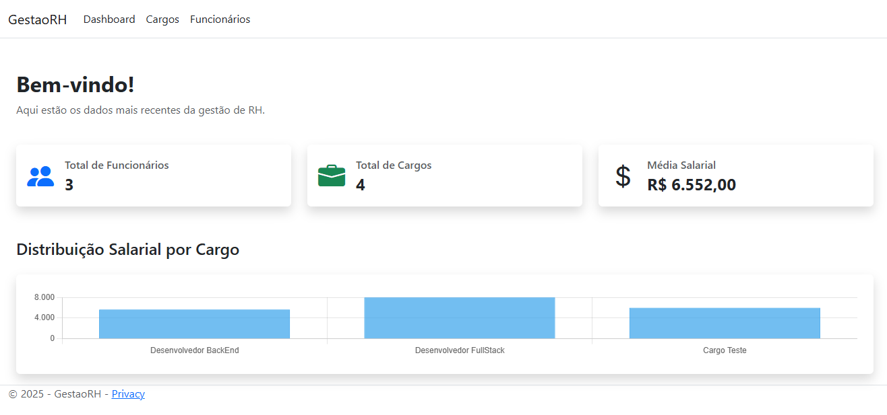
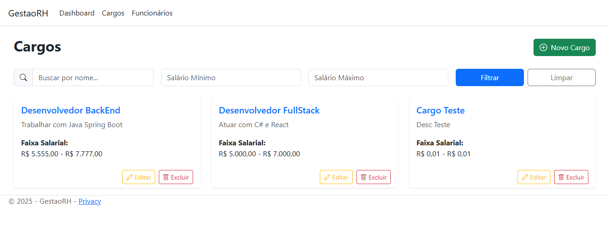
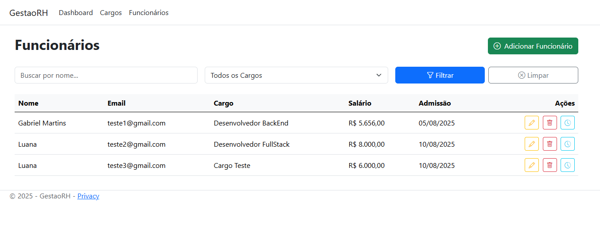
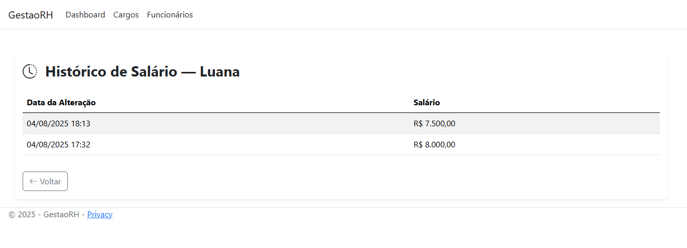
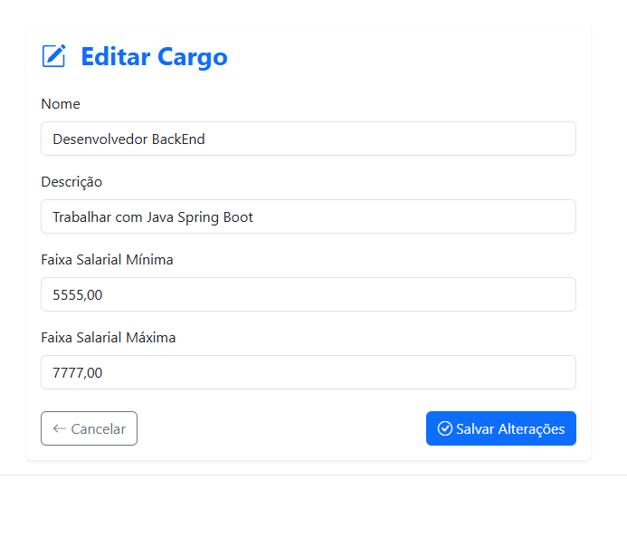
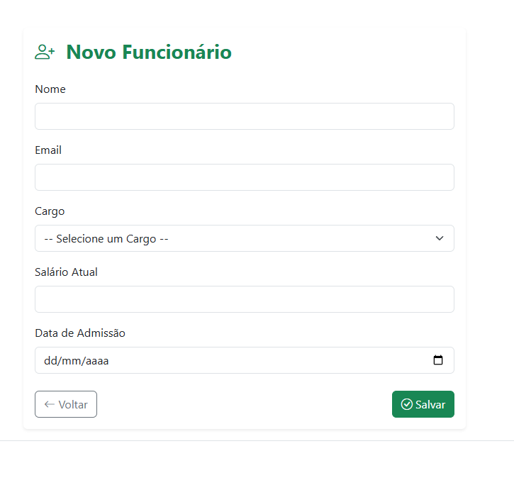

# 🧑‍💼 GestaoRH

**GestaoRH** é um sistema de gestão de cargos, funcionários e histórico salarial, com autenticação JWT, dashboard com gráficos, e integração entre frontend Razor Pages e uma API REST desenvolvida com ASP.NET Core.

---

## 🚀 Funcionalidades

- Cadastro e login com autenticação JWT
- Gestão de Cargos (CRUD)
- Gestão de Funcionários e histórico salarial (CRUD)
- Dashboard com estatísticas e gráficos
- API REST para operações com dados
- Frontend Razor Pages integrado via `HttpClient`
- Filtros e pesquisa nas listagens

---

## 🧰 Requisitos

- [.NET 8 SDK](https://dotnet.microsoft.com/en-us/download/dotnet/8.0)
- [SQL Server LocalDB ou outro servidor SQL Server](https://learn.microsoft.com/pt-br/sql/database-engine/configure-windows/sql-server-express-localdb)
- Ferramenta para gerenciar banco de dados (ex: SSMS, Azure Data Studio)

---

## 📦 Estrutura do Projeto

```text
GestaoRH/
├── GestaoRH.Core       → Modelos e validações
├── GestaoRH.Data       → DbContext e Migrations
├── GestaoRH.Api        → API REST (JWT, Controllers, DTOs)
├── GestaoRH.Web        → Frontend com Razor Pages (HttpClient, Filtros)
```

---

## ⚙️ Configuração

### 1. Banco de Dados

Crie o banco de dados com base nas migrations:

```bash
cd GestaoRH.Data
dotnet ef database update
```

---

### 2. Variáveis de Ambiente

Defina as variáveis corretamente no terminal antes de rodar:

No Powershell:
``` powershell
$env:DEFAULT_CONNECTION="Server=localhost;Database=GestaoRH;User Id=sa;Password=SuaSenha;"
$env:JWT_KEY="sua-chave-secreta"
```

No CMD:
``` cmd
set DEFAULT_CONNECTION=Server=localhost;Database=GestaoRH;User Id=sa;Password=SuaSenha;
set JWT_KEY=sua-chave-secreta
```

No Bash (Linux/macOS):
``` bash
export DEFAULT_CONNECTION="Server=localhost;Database=GestaoRH;User Id=sa;Password=SuaSenha;"
export JWT_KEY="sua-chave-secreta"
```

---

## ▶️ Como Rodar

### Backend (API REST)

```bash
cd GestaoRH.Api
dotnet run
```

A API estará acessível em: `http://localhost:5156`

---

### Frontend (Razor Pages)

```bash
cd GestaoRH.Web
dotnet run
```

A aplicação estará em: `http://localhost:5121`

---

## 🔑 Login

Após o cadastro, o sistema armazena o token JWT em cookie. As demais páginas são protegidas com um filtro personalizado (`AuthPageFilter.cs`).

---

## 🧪 Testes (opcional)

Você pode usar ferramentas como Postman ou Thunder Client para testar a API:

- `POST /api/auth/register`
- `POST /api/auth/login`
- `GET /api/cargos`
- `GET /api/funcionarios`

---

## 📌 Notas

- A autenticação é feita por JWT no backend e armazenada como cookie no frontend.
- As rotas são protegidas via filtro Razor (`AuthPageFilter.cs`).
- O frontend consome a API usando `HttpClient`.

---

## Projeto em Execução






